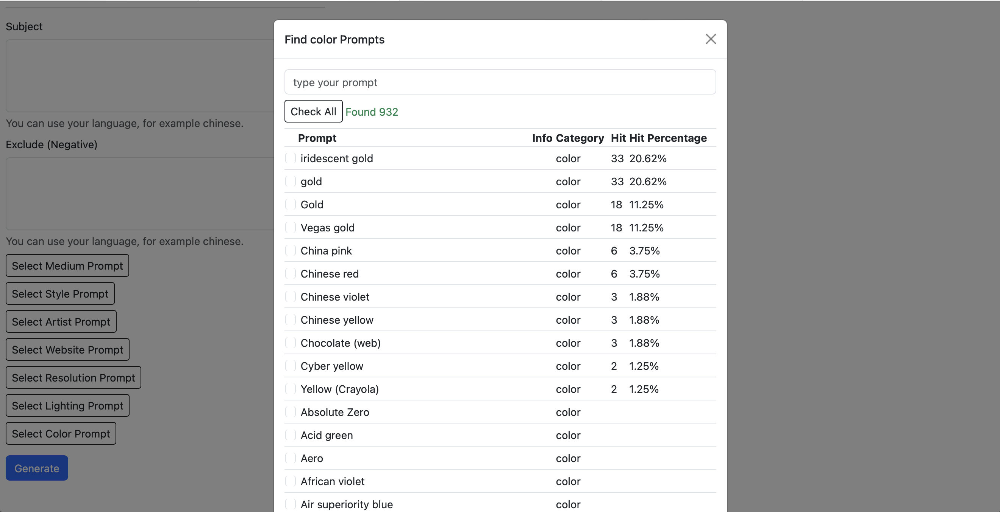

# m1-stable-diffusion-webui

An Web UI with intelligent prompts of Stable Diffusion with Core ML on Apple Silicon

# Get start

Open the home page to generate image by text.


Search prompts.



View history generated images.


# Features:

1. Use your language to write prompt, for example chinese.
2. One submit could generate multiple images. Improve your prompt writing speed.
3. Support preserve options of medium and style and artist and resolution.
4. Analysis your usage habits. Help you discover best prompt words.
5. Contains 1048 prompts. Support quick search by keyword.


We support [runwayml/stable-diffusion-v1-5](https://huggingface.co/runwayml/stable-diffusion-v1-5) and [stable-diffusion-2-1](https://huggingface.co/stabilityai/stable-diffusion-2-1) now.

- The model [runwayml/stable-diffusion-v1-5](https://huggingface.co/runwayml/stable-diffusion-v1-5) speed is around 1.x s/item.
- The model [stable-diffusion-2-1](https://huggingface.co/stabilityai/stable-diffusion-2-1) speed is greater than 2.x s/item.


# Install

Requirements:
1. Python 3.9 or latter
2. Bootstrap v5.3
3. Django 4.2
4. Apple M1

First, run command `./install.sh`. The script will install python libraries and models.

Open terminal, then run commands below:
```
cd stable_diffusion_webui
python manage.py migrate
```

Complete table Prompt.
```
python manage.py complete_prompt_word
```

# Run

Open terminal, then run commands below:
```
cd stable_diffusion_webui
python manage.py runserver
```

Use browser to open <http://127.0.0.1:8000/>

# Articles

- [扔掉Diffusers将Mac M1打造成stable diffusion AI绘画机器](https://mp.weixin.qq.com/s?__biz=MjM5NjMzMDQ0Mg==&mid=2648534433&idx=1&sn=52a5a47243cb81be4841e2b3030e85e9&chksm=bec3230489b4aa120771cda1a5917864bad8893a717562a000dc20f2d10be086f62a0ba7ee7a&token=206784746&lang=zh_CN#rd)

# Contact Us

- Email: yyaadet@qq.com
- Weixin MP:

    

